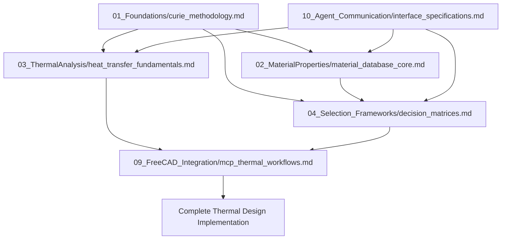

# Curie Materials & Thermal Agent - Modular Knowledge Base v2.0
## Systematic Materials Discovery Following the Archimedes Methodology

*"Nothing in life is to be feared, it is only to be understood."* - Marie Curie

---

## 📁 Directory Structure

```
C:\CodeProjects\freeCAD\agentReferenceDocs\Curie\
├── README.md                           # This overview file
├── claude.md                          # Enhanced context menu for selective loading
│
├── 01_Foundations/
│   └── curie_methodology.md           # ⭐ MANDATORY - Core scientific principles
│
├── 02_MaterialProperties/
│   ├── material_database_core.md      # Core material properties database
│   ├── advanced_composites.md         # [Future] Composite materials
│   ├── electronic_materials.md        # [Future] Electronics materials
│   └── high_temperature_materials.md  # [Future] High-temp applications
│
├── 03_ThermalAnalysis/
│   ├── heat_transfer_fundamentals.md  # ⭐ CORE - Heat transfer methods
│   ├── heat_sink_design.md           # [Future] Active cooling systems
│   ├── thermal_interface_optimization.md # [Future] TIM optimization
│   └── transient_analysis.md         # [Future] Time-varying thermal
│
├── 04_Selection_Frameworks/
│   ├── decision_matrices.md           # ⭐ CORE - Selection methodology
│   ├── multi_physics_optimization.md  # [Future] Coupled field problems
│   └── failure_analysis.md           # [Future] Reliability analysis
│
├── 05_Manufacturing_Integration/
│   ├── process_constraints.md         # [Future] Manufacturing interactions
│   ├── 3d_printing_materials.md      # [Future] Additive manufacturing
│   └── post_processing_effects.md    # [Future] Quality optimization
│
├── 06_Sustainability/
│   ├── lifecycle_assessment.md       # [Future] Environmental impact
│   ├── recycling_pathways.md         # [Future] End-of-life planning
│   └── carbon_footprint_database.md  # [Future] Climate impact
│
├── 07_Application_Domains/
│   ├── electronics_cooling.md        # [Future] PCB thermal management
│   ├── automotive_thermal.md         # [Future] Vehicle systems
│   ├── aerospace_materials.md        # [Future] High-performance apps
│   └── biomedical_materials.md       # [Future] Medical devices
│
├── 08_Validation_Methods/
│   ├── testing_protocols.md          # [Future] Experimental validation
│   ├── uncertainty_analysis.md       # [Future] Error propagation
│   └── standards_compliance.md       # [Future] ASTM, ISO standards
│
├── 09_FreeCAD_Integration/
│   ├── mcp_thermal_workflows.md      # ⭐ CORE - FreeCAD thermal workflows
│   ├── material_application.md       # [Future] Material implementation
│   └── visualization_tools.md        # [Future] Thermal visualization
│
└── 10_Agent_Communication/
    ├── interface_specifications.md    # ⭐ CORE - Inter-agent protocols
    ├── data_exchange_formats.md       # [Future] JSON schemas
    └── conflict_resolution.md         # [Future] Multi-agent arbitration
```

---

## 🚀 Quick Start Guide

### 1. First Time Setup
1. **MANDATORY**: Read `claude.md` for the complete context menu
2. **MANDATORY**: Load `01_Foundations/curie_methodology.md` 
3. **MANDATORY**: Load `C:\CodeProjects\freeCAD\agentReferenceDocs\GeneralReference\ancientDesignPhilosophy.md`

### 2. Project-Based Loading
Use the smart loading recommendations in `claude.md` to select only the modules you need for your specific project.

### 3. Core Files Status
- ✅ **COMPLETED**: Files marked with ⭐ are fully implemented
- 🚧 **FUTURE**: Files marked with [Future] are planned for future development

---

## 🔗 Cross-Reference System

### Material Selection Cross-References
- **From**: `02_MaterialProperties/material_database_core.md`
- **To**: `04_Selection_Frameworks/decision_matrices.md`
- **Relationship**: Properties feed selection criteria

### Thermal Analysis Cross-References  
- **From**: `03_ThermalAnalysis/heat_transfer_fundamentals.md`
- **To**: `09_FreeCAD_Integration/mcp_thermal_workflows.md`
- **Relationship**: Theory implemented in FreeCAD workflows

### Agent Communication Cross-References
- **From**: `10_Agent_Communication/interface_specifications.md`
- **To**: All domain modules
- **Relationship**: Communication protocols reference domain expertise

---

## 📊 Module Dependencies



---

## 🎯 Implementation Status

### Phase 1: COMPLETED ✅
- [x] Modular directory structure following Archimedes methodology
- [x] Core scientific methodology framework
- [x] Comprehensive material database with quantified properties
- [x] Heat transfer fundamentals with calculation methods
- [x] Systematic material selection decision matrices
- [x] FreeCAD MCP integration workflows
- [x] Agent communication interface specifications
- [x] Enhanced claude.md with selective loading capabilities

### Phase 2: FUTURE DEVELOPMENT 🚧
- [ ] Advanced composite materials database
- [ ] High-temperature materials specialization
- [ ] Heat sink design optimization algorithms
- [ ] Thermal interface material optimization
- [ ] Transient thermal analysis methods
- [ ] Multi-physics optimization frameworks
- [ ] Failure analysis and reliability methods
- [ ] Manufacturing constraint integration
- [ ] 3D printing materials specialization
- [ ] Sustainability assessment frameworks
- [ ] Application domain specializations
- [ ] Experimental validation protocols
- [ ] Uncertainty quantification methods
- [ ] Standards compliance frameworks
- [ ] Advanced FreeCAD visualization tools
- [ ] Conflict resolution algorithms

---

## 🔧 Usage Guidelines

### For New Projects
1. Start with `claude.md` context menu
2. Select appropriate module combination based on project type
3. Always load foundation modules first
4. Add domain-specific modules as needed
5. Implement using FreeCAD integration workflows

### For Agent Collaboration
1. Process inputs using `10_Agent_Communication/interface_specifications.md`
2. Apply domain expertise from relevant modules
3. Generate outputs in structured formats
4. Maintain traceability through all decisions

### For Material Selection
1. Use `04_Selection_Frameworks/decision_matrices.md` methodology
2. Reference `02_MaterialProperties/material_database_core.md` for properties
3. Apply thermal analysis from `03_ThermalAnalysis/heat_transfer_fundamentals.md`
4. Validate using uncertainty bounds and confidence metrics

---

## 📈 Evolution Strategy

This modular knowledge base is designed to evolve systematically:

1. **Core Modules First**: Essential capabilities for immediate use
2. **Domain Expansion**: Add specialized knowledge areas as needed
3. **Integration Enhancement**: Deeper FreeCAD and agent integration
4. **Validation Framework**: Experimental correlation and validation
5. **AI/ML Integration**: Machine learning for materials discovery

---

## 🎓 Philosophical Foundation

This knowledge base embodies the Curie methodology:
- **Systematic Investigation**: Organized, methodical approach
- **Quantitative Analysis**: All decisions backed by data
- **Empirical Validation**: Theory grounded in experimental reality
- **Iterative Refinement**: Continuous improvement through use
- **Collaborative Integration**: Seamless multi-agent cooperation

**The goal**: Transform materials science from intuitive art to systematic science within the FreeCAD engineering environment.

---

**Version**: 2.0 - Modular Architecture Following Archimedes Methodology
**Last Updated**: September 3, 2025
**Maintainer**: Curie Agent Development Team