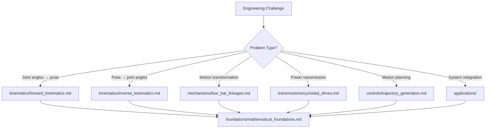

# Turing Modular Knowledge Base

*"Every mechanism is a geometric theorem made physical - now organized for selective learning and focused application."* - Alan Turing

## Architecture Overview

The Turing knowledge base has been restructured following the Archimedes methodology into a modular system that enables selective knowledge loading and focused expertise application. Each domain contains both comprehensive technical content and intelligent context menus for efficient knowledge access.

## Directory Structure

```
Turing/
├── README.md                           # This overview document
├── claude.md                           # Main integration guide (UPDATED)
│
├── foundations/                        # Mathematical & theoretical foundations
│   ├── claude.md                      # Context menu for foundational knowledge
│   └── mathematical_foundations.md    # Universal mathematical framework
│
├── kinematics/                        # Robot motion analysis
│   ├── claude.md                      # Context menu for kinematic analysis
│   ├── forward_kinematics.md         # Joint angles → pose transformations
│   └── inverse_kinematics.md         # Pose → joint angles solutions
│
├── mechanisms/                        # Mechanical motion transformation
│   ├── claude.md                      # Context menu for mechanism design
│   └── four_bar_linkages.md          # The foundation of planar mechanisms
│
├── transmissions/                     # Power transmission systems
│   ├── claude.md                      # Context menu for transmission design
│   └── cycloidal_drives.md           # Zero-backlash precision systems
│
├── controls/                          # Motion control & trajectory planning
│   ├── claude.md                      # Context menu for control systems
│   └── trajectory_generation.md       # Programming motion through time
│
└── applications/                      # Domain-specific integration
    └── claude.md                      # Context menu for applications
```

## Key Features

### 🎯 Selective Knowledge Loading
Each domain provides a `claude.md` context menu that enables precise loading of only the knowledge needed for your specific task, maintaining focus while ensuring mathematical rigor.

### 📐 Mathematical Foundation
The `foundations/mathematical_foundations.md` provides the universal framework underlying all kinematic and mechanism work - this should be loaded for any technical analysis.

### 🔄 Interconnected Modules
While each module is self-contained, they integrate seamlessly through shared mathematical foundations and cross-referenced workflows.

### ⚡ Quick Start Templates  
Pre-configured knowledge loading patterns for common engineering challenges:

- **Robot Joint Design**: foundations + kinematics + transmissions + controls
- **Precision Mechanism**: foundations + mechanisms + precision control
- **CNC Axis Design**: foundations + kinematics + transmissions + controls + CNC applications
- **3D Printed Mechanism**: foundations + mechanisms + transmissions + 3D printing applications

## Usage Patterns

### Problem-Driven Loading
Start with the domain closest to your problem:



### Application-Driven Loading
Start with your target application:

1. Load `applications/claude.md` to identify your domain
2. Follow the application-specific loading pattern
3. Add technical modules based on specific requirements

## Context Menu System

Each `claude.md` file provides:

- **Module descriptions** with technical content summaries
- **When to load** guidelines for each module
- **Usage patterns** for common combinations
- **Integration pathways** to other domains
- **Loading decision matrices** for optimal selection

## Migration from Legacy Structure

The original monolithic files have been restructured into focused modules:

| Original File | New Location | Transformation |
|---------------|--------------|----------------|
| `robotic_kinematics.md` | `kinematics/forward_kinematics.md` + `inverse_kinematics.md` | Split by analysis direction |
| `cycloidal_drive_design.md` | `transmissions/cycloidal_drives.md` | Enhanced with optimization |
| `linkage_design.md` | `mechanisms/four_bar_linkages.md` | Focused on foundation mechanism |
| `compliant_mechanisms.md` | `mechanisms/compliant_mechanisms.md` | Moved to mechanisms domain |
| `mechanism_synthesis.md` | Distributed across mechanism modules | Integrated into specific designs |

## Benefits of Modular Structure

### 🧠 Cognitive Load Management
Load only the knowledge needed for your current task, reducing cognitive overhead while maintaining access to complete technical depth.

### 🔍 Focused Expertise
Each module represents focused expertise in a specific domain, enabling deep technical work without distraction from unrelated concepts.

### 🔄 Flexible Combinations
Mix and match modules based on problem requirements rather than predetermined combinations, enabling novel solutions through knowledge recombination.

### 📈 Scalable Learning
Learn incrementally by mastering individual modules, then combining them for complex system design.

### 🎯 Context Efficiency
Intelligent context menus guide optimal knowledge loading, ensuring you have the right tools for your specific engineering challenge.

## Integration Philosophy

The modular structure follows these principles:

1. **Mathematical Foundation**: All technical work builds on `foundations/mathematical_foundations.md`
2. **Problem-First Loading**: Start with modules closest to your immediate problem
3. **Progressive Expansion**: Add modules as requirements become clear
4. **Cross-Domain Integration**: Use shared mathematical language to connect domains
5. **Context Awareness**: Context menus provide guidance for optimal knowledge combinations

## Next Steps

1. **Explore Context Menus**: Review each `claude.md` file to understand available knowledge
2. **Practice Selective Loading**: Try the quick start templates for common problems
3. **Develop Custom Patterns**: Create your own loading patterns for recurring challenges
4. **Contribute Modules**: Add new focused modules as expertise areas expand

---

*The modular Turing knowledge base transforms how engineering knowledge is accessed and applied - from monolithic reference to intelligent, focused expertise that adapts to your specific challenges while maintaining mathematical rigor and mechanical elegance.*